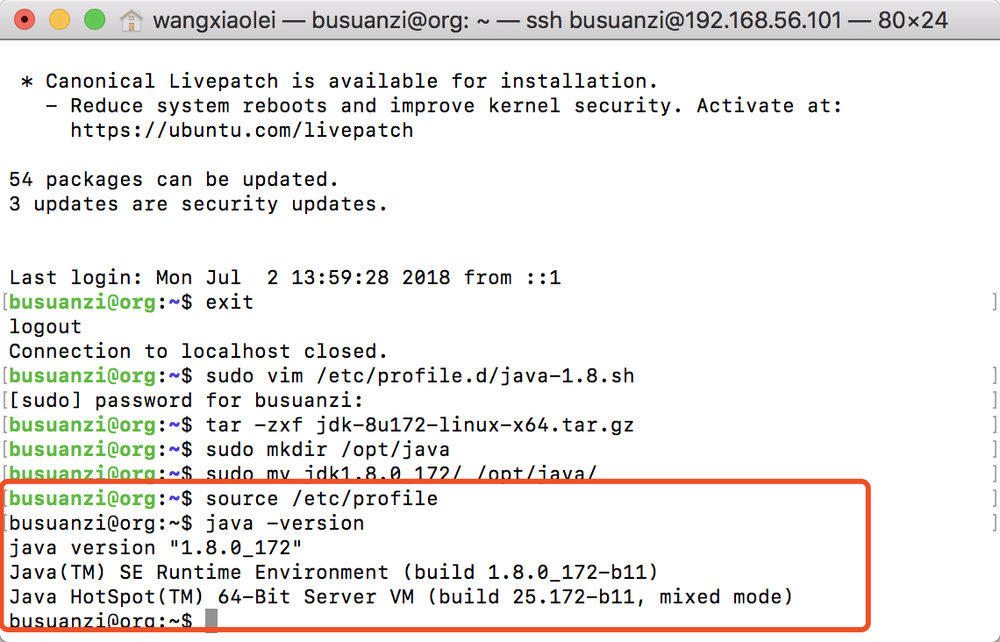
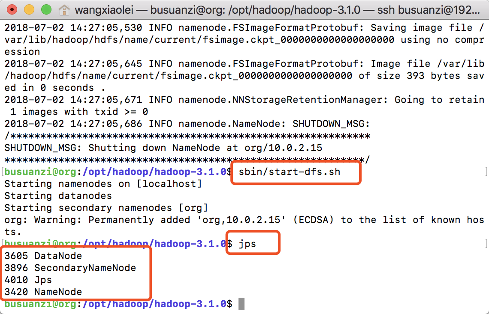
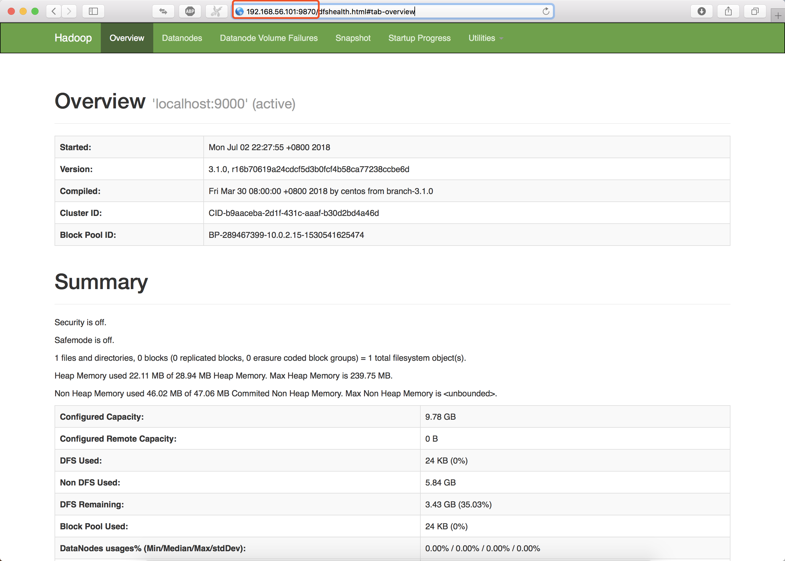
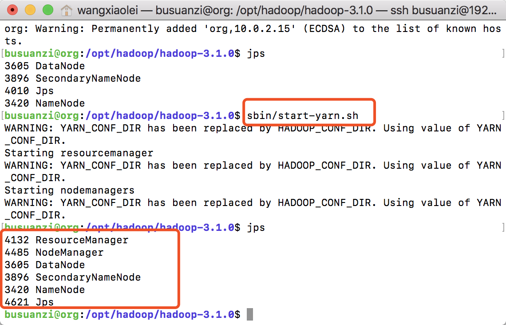
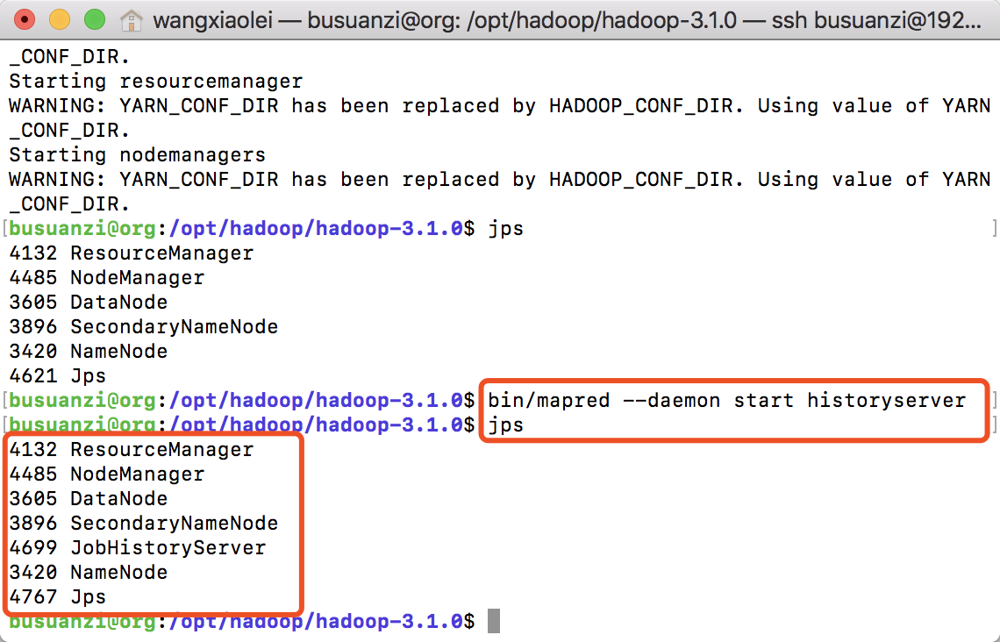

# 2.4 Hadoop伪分布式快速部署
“[卜算子·大数据](https://github.com/wangxiaoleiAI/big-data)”一个开源、成体系的大数据学习教程。——每周日更新

本节主要内容：

- 依赖安装、免密登录
- 安装Java
- 伪分布式——Hadoop MapReduce配置
- 配置Hadoop环境变量
- 伪分布式——Hadoop MapReduce开启
- 伪分布式——YARN配置
- 伪分布式——YARN开启
- Hadoop 开启历史查看服务
- Hadoop 停止伪分布式集群命令


## 2.4.1 依赖安装、免密登录
依赖安装
```sh
sudo apt install ssh
sudo apt install pdsh
```
免密登录
```ssh
# 创建ssh密匙，执行如下命令后回车到底
ssh-keygen -t rsa
# 将产生的公共密匙追加到authorized_keys
cat ~/.ssh/id_rsa.pub >> ~/.ssh/authorized_keys
# 尝试免密码登录（初次登录会询问然后需要输入yes，二次登录可以直接登录）配置成功
ssh localhost
```
### 2.4.2 安装Java

- Java文件

```sh
# 创建jdk文件夹
sudo mkdir -p /opt/java

# 进入Downloads文件夹
cd ~/Downloads

# 通过wget下载
wget --no-check-certificate --no-cookies --header "Cookie: oraclelicense=accept-securebackup-cookie" http://download.oracle.com/otn-pub/java/jdk/8u172-b11/a58eab1ec242421181065cdc37240b08/jdk-8u172-linux-x64.tar.gz

# 解压
tar -zxf jdk-8u172-linux-x64.tar.gz

# 将jdk文件夹移动到/opt/java/
sudo mv jdk1.8.0_172/ /opt/java/jdk1.8.0_172/
```
- 在服务器database（192.168.56.110）上安装Cassandra
- 配置Java变量文件[源码](./../../code/chapter2/2.1hadoop-single-cluster)

1.通过vim创建jdk-1.8.sh文件
```sh
sudo vim /etc/profile.d/jdk-1.8.sh
```
2.添加如下内容
```sh
#!/bin/sh
# Author:wangxiaolei 王小雷
# Blog: http://blog.csdn.net/dream_an
# Github: https://github.com/wangxiaoleiai
# project: https://github.com/wangxiaoleiai/big-data
# Date: 2018.07

export JAVA_HOME=/opt/java/jdk1.8.0_172
export JRE_HOME=${JAVA_HOME}/jre
export CLASSPATH=.:${JAVA_HOME}/lib:${JRE_HOME}/lib
export PATH=${JAVA_HOME}/bin:$PATH
```
3.让Java变量生效
```sh
source /etc/profile
```
4.查看已配置完成的Java
```sh
java -version
```




## 2.4.3 伪分布式——Hadoop MapReduce配置

1. etc/hadoop/hadoop-env.sh

```sh
export JAVA_HOME=/opt/java/jdk1.8.0_172
```

2. etc/hadoop/core-site.xml

```xml
<configuration>
    <property>
        <name>fs.defaultFS</name>
        <value>hdfs://localhost:9000</value>
    </property>
    <property>
      <name>hadoop.proxyuser.busuanzi.hosts</name>
      <value>*</value>
    </property>
    <property>
      <name>hadoop.proxyuser.busuanzi.groups</name>
      <value>*</value>
    </property>
</configuration>

```

3. etc/hadoop/hdfs-site.xml

```xml
<configuration>

    <property>
      <name>dfs.namenode.name.dir</name>
      <value>/var/lib/hadoop/hdfs/name/</value>
    </property>
    <property>
      <name>dfs.datanode.data.dir</name>
      <value>/var/lib/hadoop/hdfs/data/</value>
    </property>
    <property>
        <name>dfs.replication</name>
        <value>1</value>
    </property>

</configuration>
```

## 2.4.4 配置Hadoop环境变量

```sh
sudo vim /etc/profile.d/hadoop-3.1.0.sh
```
增加如下内容

```sh
#!/bin/sh
# Author:wangxiaolei 王小雷
# Github: https://github.com/wangxiaoleiai

export HADOOP_HOME="/opt/hadoop/hadoop-3.1.0"
export PATH="$HADOOP_HOME/bin:$PATH"
export HADOOP_CONF_DIR=$HADOOP_HOME/etc/hadoop
export YARN_CONF_DIR=$HADOOP_HOME/etc/hadoop
```
使变量生效
```sh
source /etc/profile
```

## 2.4.5 伪分布式——Hadoop MapReduce开启
1. 创建HDFS系统文件，并且改权限为hadoop用户，设置rcmd_default入口。

```sh
sudo mkdir /var/lib/hadoop
sudo chown busuanzi:busuanzi /var/lib/hadoop/
```

```bash
# 新建rcmd_default文件
# 设置rcmd_default入口，避免出现 master: rcmd: socket: Permission denied
sudo sh -c "echo "ssh" > /etc/pdsh/rcmd_default"
```

２. 格式化(注意格式化只需要执行一次即可)

```sh
cd /opt/hadoop/hadoop-3.1.0/
bin/hdfs namenode -format
```


3. 开启NameNode和DataNode

```sh
sbin/start-dfs.sh
```


4. jps查看启动成功

```sh
jps
```


5. 浏览器访问namenode http://192.168.56.101:9870/

注意，自Hadoop3.0之后，端口5007变成端口9870[官方解释](https://issues.apache.org/jira/browse/HDFS-9427)





## 2.4.6 伪分布式——Hadoop YARN配置、开启 [源码](./../../code/chapter2/2.1hadoop-single-cluster)

1. etc/hadoop/mapred-site.xml:

```xml
<configuration>
    <property>
        <name>mapreduce.framework.name</name>
        <value>yarn</value>
    </property>
    <property>
        <name>mapreduce.application.classpath</name>
        <value>$HADOOP_MAPRED_HOME/share/hadoop/mapreduce/*:$HADOOP_MAPRED_HOME/share/hadoop/mapreduce/lib/*</value>
    </property>
</configuration>
```

2. etc/hadoop/yarn-site.xml:

```xml
<configuration>
    <property>
        <name>yarn.nodemanager.aux-services</name>
        <value>mapreduce_shuffle</value>
    </property>
    <property>
        <name>yarn.nodemanager.env-whitelist</name>
        <value>JAVA_HOME,HADOOP_COMMON_HOME,HADOOP_HDFS_HOME,HADOOP_CONF_DIR,CLASSPATH_PREPEND_DISTCACHE,HADOOP_YARN_HOME,HADOOP_MAPRED_HOME</value>
    </property>
</configuration>
```

## 2.4.7 伪分布式——YARN开启

1. 启动YARN
```sh
sbin/start-yarn.sh
```

2. 使用jps查看启动情况
```sh
jps
```


3. 浏览器访问ResourceManager http://192.168.56.101:8088/


至此，伪分布式部署完成。

## 2.4.8 开启历史查看服务

```sh
bin/mapred --daemon start historyserver
```



访问 http://192.168.56.101:19888/


## 2.4.9 Hadoop 停止伪分布式集群命令

1. 停止YARN

```sh
sbin/stop-yarn.sh
```

2. 停止Namenode和Datanode

```sh
sbin/stop-dfs.sh
```

3. 停止历史服务

```sh
bin/mapred --daemon stop historyserver
```


:clap:本节完成

长按关注**从入门到精通**


**开源、源码获取**   https://github.com/wangxiaoleiAI/big-data


---

**分割线以下可忽略**

:izakaya_lantern: 如果要清除Hadoop，彻底删除Hadoop相关文件与配置

```sh
rm -rf /opt/hadoop/hadoop-3.1.0/logs
rm -rf /var/lib/hadoop/*
```
:izakaya_lantern: 拓展——Hadoop哪些端口在3.0之后被改掉

```
Namenode ports
----------------
50070 --> 9070
50470 --> 9470

Datanode ports
---------------
50010 --> 9010
50020 --> 9020
50075 --> 9075
50475 --> 9475

Secondary NN ports
---------------
50090 --> 9090
50091 --> 9091
```
