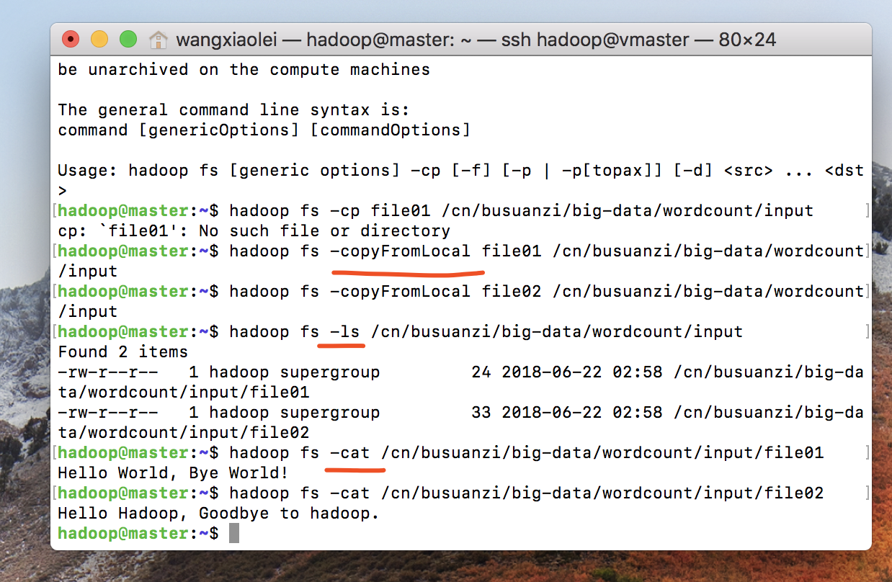
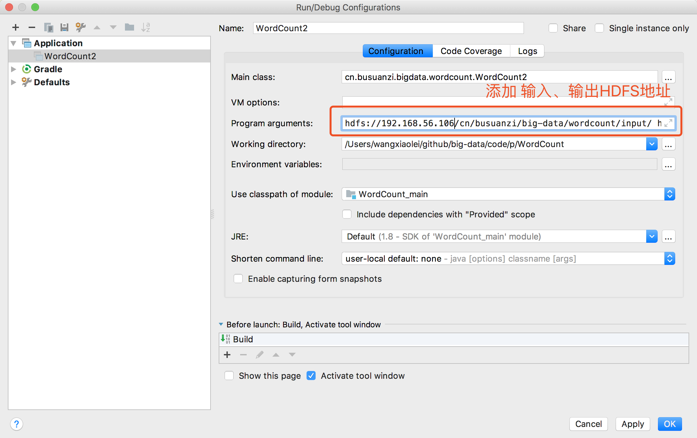
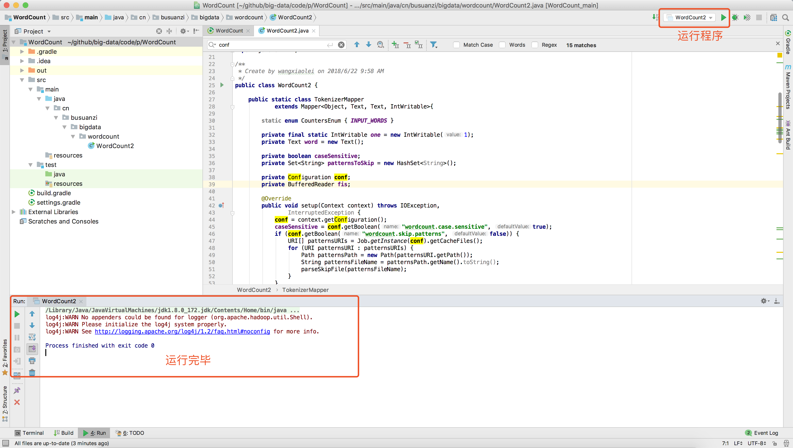

# 2.3 基于IDEA开发第一个MapReduce大数据程序WordCount

>开源地址 https://github.com/wangxiaoleiAI/big-data

[卜算子·大数据 目录](./../../README.md)

>开源“卜算子·大数据”系列文章、源码，面向大数据（分布式计算）的编程、应用、架构——每周更新！Linux、Java、Hadoop、Spark、Sqoop、hive、pig、hbase、zookeeper、Oozie、flink...etc

本节主要内容：

前提：已经有了大数据集群　[2.2 Hadoop3.1.0完全分布式集群配置与部署](./2.2.Hadoop完全分布式集群配置与部署.md)

- 在intellij IDEA中创建一个Gradle的Java程序。
- 引入依赖
- 编写第一个WordCount程序
- 启动大数据集群
- 在Idea中运行（开发、调试）
- 在集群中运行（生产）
- [项目源码](https://github.com/wangxiaoleiAI/big-data/tree/master/code/chapter2/2.3word-count-map-reduce)


## 2.3.1 HDFS操作

>[官方命令大全](https://hadoop.apache.org/docs/r3.1.0/hadoop-project-dist/hadoop-common/FileSystemShell.html#copyFromLocal)

### 2.3.1.1 创建HDFS文件夹,创建 输入、输出分布式文件夹，

```sh
hadoop fs -mkdir -p /cn/busuanzi/big-data/wordcount/input
hadoop fs -mkdir -p /cn/busuanzi/big-data/wordcount/output
hadoop fs -chmod 777 /cn/busuanzi/big-data/wordcount/output
```

### 2.3.1.2 创建本地数据文件并将本地文件复制到分布式文件系统input中
```sh
echo "Hello World, Bye World!" > file01
echo "Hello Hadoop, Goodbye to hadoop." > file02

hadoop fs -copyFromLocal file01 /cn/busuanzi/big-data/wordcount/input
hadoop fs -copyFromLocal file02 /cn/busuanzi/big-data/wordcount/input
```


### 2.3.1.3 查看input数据内容
```sh
hadoop fs -cat /cn/busuanzi/big-data/wordcount/input/file01
hadoop fs -cat /cn/busuanzi/big-data/wordcount/input/file02
```



## 2.3.2 更改输出文件权限，任何人有写权限。因为从本地直接使用服务器的大数据集群环境，服务器集群文件没有写权限。

```sh
hadoop fs -mkdir -p /cn/busuanzi/big-data/wordcount/output
hadoop fs -chmod 777 /cn/busuanzi/big-data/wordcount/output/1
```

## 2.3.3 创建项目
### 2.3.3.1 [项目源码](https://github.com/wangxiaoleiAI/big-data/tree/master/code/chapter2/2.3word-count-map-reduce)可以下载源码，直接导入项目，跳过此步骤。

gradle配置如下

```Gradle
plugins {
    id 'java'
}

group 'cn.busuanzi.big-data'
version '1.0-SNAPSHOT'

sourceCompatibility = 1.8

repositories {
    mavenCentral()
}

dependencies {
    compile group: 'org.apache.hadoop', name: 'hadoop-mapreduce-client-core', version: '3.1.0'
    compile group: 'org.apache.hadoop', name: 'hadoop-common', version: '3.1.0'
    compile group: 'org.apache.hadoop', name: 'hadoop-client', version: '3.1.0'

    testCompile group: 'junit', name: 'junit', version: '4.12'
}
```

### 2.3.3.2 WordCout2.java [项目源码](https://github.com/wangxiaoleiAI/big-data/tree/master/code/chapter2/2.3word-count-map-reduce)

```Java
package cn.busuanzi.bigdata.wordcount;

import org.apache.hadoop.conf.Configuration;
import org.apache.hadoop.fs.Path;
import org.apache.hadoop.io.IntWritable;
import org.apache.hadoop.io.Text;
import org.apache.hadoop.mapreduce.Counter;
import org.apache.hadoop.mapreduce.Job;
import org.apache.hadoop.mapreduce.Mapper;
import org.apache.hadoop.mapreduce.Reducer;
import org.apache.hadoop.mapreduce.lib.input.FileInputFormat;
import org.apache.hadoop.mapreduce.lib.output.FileOutputFormat;
import org.apache.hadoop.util.GenericOptionsParser;
import org.apache.hadoop.util.StringUtils;

import java.io.BufferedReader;
import java.io.FileReader;
import java.io.IOException;
import java.net.URI;
import java.util.*;

/**
 * Create by wangxiaolei on 2018/6/22 9:58 AM
 */
public class WordCount2 {

    public static class TokenizerMapper
            extends Mapper<Object, Text, Text, IntWritable>{

        static enum CountersEnum { INPUT_WORDS }

        private final static IntWritable one = new IntWritable(1);
        private Text word = new Text();

        private boolean caseSensitive;
        private Set<String> patternsToSkip = new HashSet<String>();

        private Configuration conf;
        private BufferedReader fis;

        @Override
        public void setup(Context context) throws IOException,
                InterruptedException {
            conf = context.getConfiguration();
            caseSensitive = conf.getBoolean("wordcount.case.sensitive", true);
            if (conf.getBoolean("wordcount.skip.patterns", false)) {
                URI[] patternsURIs = Job.getInstance(conf).getCacheFiles();
                for (URI patternsURI : patternsURIs) {
                    Path patternsPath = new Path(patternsURI.getPath());
                    String patternsFileName = patternsPath.getName().toString();
                    parseSkipFile(patternsFileName);
                }
            }
        }

        private void parseSkipFile(String fileName) {
            try {
                fis = new BufferedReader(new FileReader(fileName));
                String pattern = null;
                while ((pattern = fis.readLine()) != null) {
                    patternsToSkip.add(pattern);
                }
            } catch (IOException ioe) {
                System.err.println("Caught exception while parsing the cached file '"
                        + StringUtils.stringifyException(ioe));
            }
        }

        @Override
        public void map(Object key, Text value, Context context
        ) throws IOException, InterruptedException {
            String line = (caseSensitive) ?
                    value.toString() : value.toString().toLowerCase();
            for (String pattern : patternsToSkip) {
                line = line.replaceAll(pattern, "");
            }
            StringTokenizer itr = new StringTokenizer(line);
            while (itr.hasMoreTokens()) {
                word.set(itr.nextToken());
                context.write(word, one);
                Counter counter = context.getCounter(CountersEnum.class.getName(),
                        CountersEnum.INPUT_WORDS.toString());
                counter.increment(1);
            }
        }
    }

    public static class IntSumReducer
            extends Reducer<Text,IntWritable,Text,IntWritable> {
        private IntWritable result = new IntWritable();

        public void reduce(Text key, Iterable<IntWritable> values,
                           Context context
        ) throws IOException, InterruptedException {
            int sum = 0;
            for (IntWritable val : values) {
                sum += val.get();
            }
            result.set(sum);
            context.write(key, result);
        }
    }

    public static void main(String[] args) throws Exception {
        Configuration conf = new Configuration();
        GenericOptionsParser optionParser = new GenericOptionsParser(conf, args);
        String[] remainingArgs = optionParser.getRemainingArgs();
        if ((remainingArgs.length != 2) && (remainingArgs.length != 4)) {
            System.err.println("Usage: wordcount <in> <out> [-skip skipPatternFile]");
            System.exit(2);
        }
        Job job = Job.getInstance(conf, "word count");
        job.setJarByClass(WordCount2.class);
        job.setMapperClass(TokenizerMapper.class);
        job.setCombinerClass(IntSumReducer.class);
        job.setReducerClass(IntSumReducer.class);
        job.setOutputKeyClass(Text.class);
        job.setOutputValueClass(IntWritable.class);

        List<String> otherArgs = new ArrayList<String>();
        for (int i=0; i < remainingArgs.length; ++i) {
            if ("-skip".equals(remainingArgs[i])) {
                job.addCacheFile(new Path(remainingArgs[++i]).toUri());
                job.getConfiguration().setBoolean("wordcount.skip.patterns", true);
            } else {
                otherArgs.add(remainingArgs[i]);
            }
        }
        FileInputFormat.addInputPath(job, new Path(otherArgs.get(0)));
        FileOutputFormat.setOutputPath(job, new Path(otherArgs.get(1)));

        System.exit(job.waitForCompletion(true) ? 0 : 1);
    }
}
```


## 2.3.4 IDEA运行设置参数

更改运行参数设置，添加输入、输出参数

```text
hdfs://192.168.56.106:9000/cn/busuanzi/wordcount/input/
hdfs://192.168.56.106:9000/cn/busuanzi/wordcount/output/
```



### 2.3.5 IDEA运行程序



## 2.3.6 查看wordcout输出结果

```sh
#　查看当前output文件下内容
hadoop fs -ls /cn/busuanzi/big-data/wordcount/output/
#　文件已经多了一个1的文件夹
hadoop fs -ls /cn/busuanzi/big-data/wordcount/output/1
# 查看part-r-00000结果文件
hadoop fs -cat /cn/busuanzi/big-data/wordcount/output/1/part-r-00000
```


## 2.3.7 命令行提交Jar，将本地文件scp到大数据集群master服务器上（生产环境）

### 2.3.7.1 使用Gradle打jar包
在项目根目录，运行命令，打完包后默认build/libs/WordCount-1.0-SNAPSHOT.jar
```sh
gradle build
```

### 2.3.7.2　将本地文件scp到大数据集群master服务器上
```sh
scp scp WordCount-1.0-SNAPSHOT.jar hadoop@192.168.56.106:/home/hadoop/
```

## 2.3.8 命令行运行程序（生产环境）

```sh
hadoop jar WordCount-1.0-SNAPSHOT.jar cn/busuanzi/bigdata/wordcount/WordCount2 /cn/busuanzi/big-data/wordcount/input/ /cn/busuanzi/big-data/wordcount/output/2

```

查看输出结果
```sh
hadoop fs -cat /cn/busuanzi/big-data/wordcount/output/2/part-r-00000
```


## 2.3.9 至此已经完成了第一个大数据程序，具体的是基于Hadoop的MapReduce做的单词计数。

- 该教程主要是为了掌握大数据编程的正常的开发流程和方法。

- 利用本地集群、常用开发工具(idea\eclipse)来做大数据的开发、调试与快捷的打包提交大数据程序到集群。

- 至于涉及Hadoop安全问题，将会在之后的章节讲解。

- 至于涉及MapReduce原理，将在后续章节讲解。
