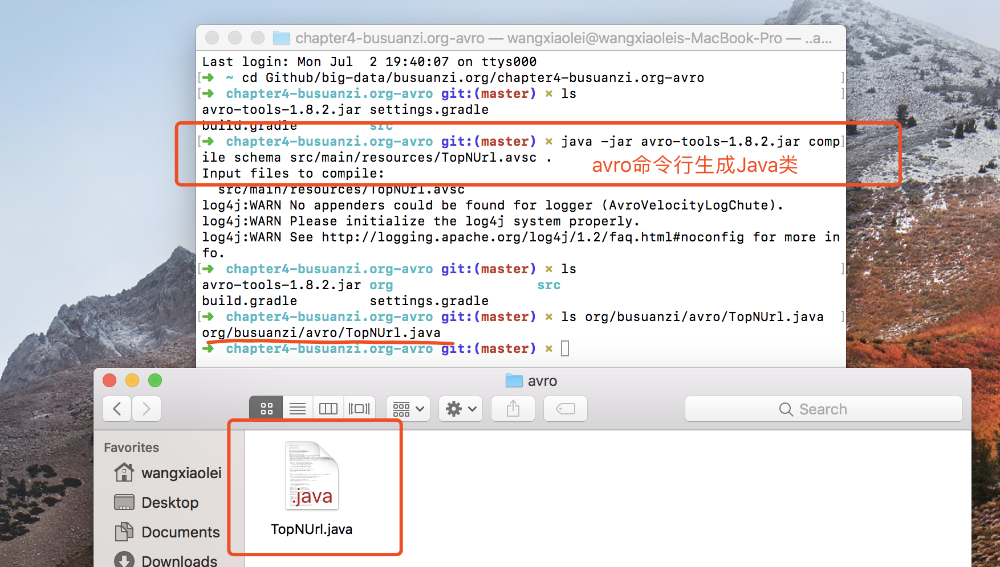
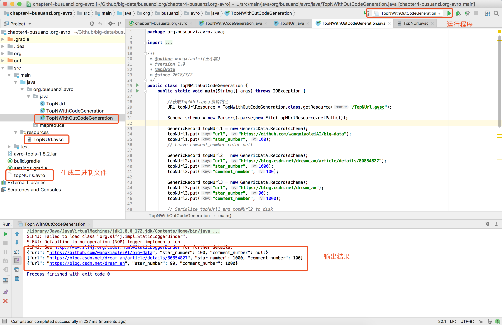

# 4.2ApacheAvro编程Java示例

“[卜算子·大数据](https://github.com/wangxiaoleiAI/big-data)”一个开源、成体系的大数据学习教程。——每周日更新

本节主要内容：

- 创建Gradle项目、创建Avro模式
- 使用Avro命令行工具生成Java代码
- 不使用Avro命令行工具生成Java代码

## 4.2.1 创建Gradle项目、创建Avro模式 [Github源码](https://github.com/wangxiaoleiAI/big-data/busuanzi.org/chapter4-busuanzi.org-avro)

**创建Gradle项目** 添加Avro依赖
```Gradle
compile group: 'org.apache.avro', name: 'avro', version: '1.8.2'

```

**创建Avro模式**
```avro
{"namespace": "org.busuanzi.avro",
 "type": "record",
 "name": "TopNUrl",
 "fields": [
     {"name": "url", "type": "string"},
     {"name": "star_number",  "type": ["int", "null"]},
     {"name": "comment_number", "type": ["int", "null"]}
 ]
}
```


## 4.2.2 使用Avro命令行工具生成Java代码
```sh
java -jar avro-tools-1.8.2.jar compile schema src/main/resources/TopNUrl.avsc .
```



并将生成的TopNUrl.java **复制** 到项目中

**TopNWithCodeGeneration.java**
```Java
package org.busuanzi.avro.java;

import java.io.File;
import java.io.IOException;

import org.apache.avro.file.DataFileReader;
import org.apache.avro.file.DataFileWriter;
import org.apache.avro.io.DatumReader;
import org.apache.avro.io.DatumWriter;
import org.apache.avro.specific.SpecificDatumReader;
import org.apache.avro.specific.SpecificDatumWriter;

/**
 * @author wangxiaolei(王小雷)
 * @version 1.0
 * @apiNote
 * @since 2018/7/2
 */
public class TopNWithCodeGeneration {
    public static void main(String[] args) throws IOException {
        // 此处TopNUrl需要通过java -jar avro-tools-1.8.2.jar compile schema TopNUrl.avsc . 自动生成TopNUrl.java
        TopNUrl TopNUrl1 = new TopNUrl();
        TopNUrl1.setUrl("https://github.com/wangxiaoleiAI/big-data");
        TopNUrl1.setStarNumber(1000);
        // Leave favorite color null

        // Alternate constructor
        TopNUrl TopNUrl2 = new TopNUrl("https://blog.csdn.net/dream_an/article/details/80854827", 100, 30);

        // Construct via builder
        TopNUrl TopNUrl3 = TopNUrl.newBuilder()
                .setUrl("https://blog.csdn.net/dream_an")
                .setStarNumber(10000)
                .setCommentNumber(null)
                .build();

        // Serialize TopNUrl1 and TopNUrl2 to disk
        File file = new File("TopNUrls.avro");
        DatumWriter<TopNUrl> TopNUrlDatumWriter = new SpecificDatumWriter<TopNUrl>(TopNUrl.class);
        DataFileWriter<TopNUrl> dataFileWriter = new DataFileWriter<TopNUrl>(TopNUrlDatumWriter);
        dataFileWriter.create(TopNUrl1.getSchema(), file);
        dataFileWriter.append(TopNUrl1);
        dataFileWriter.append(TopNUrl2);
        dataFileWriter.append(TopNUrl3);
        dataFileWriter.close();

        // Deserialize TopNUrls from disk
        DatumReader<TopNUrl> TopNUrlDatumReader = new SpecificDatumReader<TopNUrl>(TopNUrl.class);
        DataFileReader<TopNUrl> dataFileReader = new DataFileReader<TopNUrl>(file, TopNUrlDatumReader);
        TopNUrl TopNUrl = null;
        while (dataFileReader.hasNext()) {
            // Reuse TopNUrl object by passing it to next(). This saves us from
            // allocating and garbage collecting many objects for files with
            // many items.
            TopNUrl = dataFileReader.next(TopNUrl);
            System.out.println(TopNUrl);
        }

    }
}

```


- 输出结果
- 生成二进制文件

### 4.2.3 不使用Avro命令行工具生成Java代码
**TopNWithOutCodeGeneration.java**
```Java
package org.busuanzi.avro.java;

import java.io.File;
import java.io.IOException;
import java.net.URL;

import com.sun.xml.internal.ws.api.ResourceLoader;
import org.apache.avro.Schema;
import org.apache.avro.Schema.Parser;
import org.apache.avro.file.DataFileReader;
import org.apache.avro.file.DataFileWriter;
import org.apache.avro.generic.GenericData;
import org.apache.avro.generic.GenericDatumReader;
import org.apache.avro.generic.GenericDatumWriter;
import org.apache.avro.generic.GenericRecord;
import org.apache.avro.io.DatumReader;
import org.apache.avro.io.DatumWriter;

/**
 * @author wangxiaolei(王小雷)
 * @version 1.0
 * @apiNote
 * @since 2018/7/2
 */
public class TopNWithOutCodeGeneration {
    public static void main(String[] args) throws IOException {

        //获取TopNUrl.avsc资源路径
        URL topNUrlResource = TopNWithOutCodeGeneration.class.getResource("/TopNUrl.avsc");

        Schema schema = new Parser().parse(new File(topNUrlResource.getPath()));

        GenericRecord topNUrl1 = new GenericData.Record(schema);
        topNUrl1.put("url", "https://github.com/wangxiaoleiAI/big-data");
        topNUrl1.put("star_number", 100);
        // Leave comment_number color null

        GenericRecord topNUrl2 = new GenericData.Record(schema);
        topNUrl2.put("url", "https://blog.csdn.net/dream_an/article/details/80854827");
        topNUrl2.put("star_number", 1000);
        topNUrl2.put("comment_number", 100);

        GenericRecord topNUrl3 = new GenericData.Record(schema);
        topNUrl3.put("url", "https://blog.csdn.net/dream_an");
        topNUrl3.put("star_number", 90);
        topNUrl3.put("comment_number", 1000);

        // Serialize topNUrl1 and topNUrl2 to disk
        File file = new File("topNUrls.avro");
        // 区别：此处是通用的GenericRecord，而不是事先生成特定的"topNUrl"类
        DatumWriter<GenericRecord> datumWriter = new GenericDatumWriter<GenericRecord>(schema);
        DataFileWriter<GenericRecord> dataFileWriter = new DataFileWriter<GenericRecord>(datumWriter);
        dataFileWriter.create(schema, file);
        dataFileWriter.append(topNUrl1);
        dataFileWriter.append(topNUrl2);
        dataFileWriter.append(topNUrl3);
        dataFileWriter.close();

        // Deserialize topNUrls from disk
        DatumReader<GenericRecord> datumReader = new GenericDatumReader<GenericRecord>(schema);
        DataFileReader<GenericRecord> dataFileReader = new DataFileReader<GenericRecord>(file, datumReader);
        GenericRecord topNUrl = null;
        while (dataFileReader.hasNext()) {
            // Reuse topNUrl object by passing it to next(). This saves us from
            // allocating and garbage collecting many objects for files with
            // many items.
            topNUrl = dataFileReader.next(topNUrl);
            System.out.println(topNUrl);
        }

    }
}

```



:clap:本节完成

长按关注**从入门到精通**


**开源、源码获取**   https://github.com/wangxiaoleiAI/big-data
