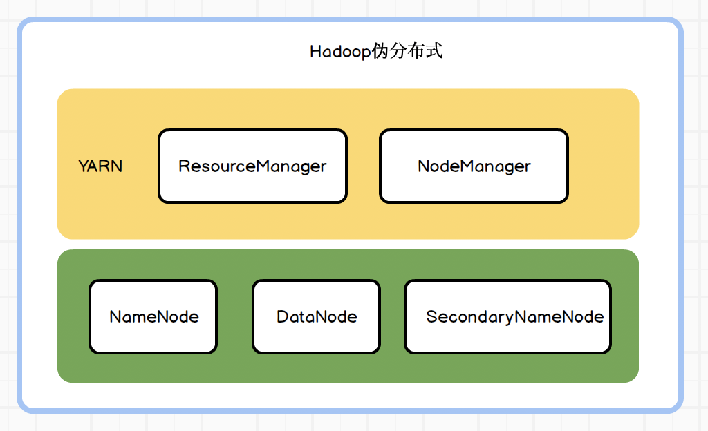

# 1.hadoop部署模式分类
- 本地模式
- 伪分布式，单台机器模拟多台机器分布式环境。
- 完全分布式（高可用HA），多台机器且不同的机器负责不同的角色。
    - 高可用QJM（Quorum Journal Manager）
    - 高可用NFS (HDFS High Availability )

本次为伪分布式部署




# 2.安装必要软件
## 2.1 Ubuntu18.04安装JDK

- jdk 11版本支持不友好，最好使用jdk 8版本。

```sh 
scp ~/Documents/bigfile/jdk/jdk-8u231-linux-x64.tar.gz xiaolei@192.168.56.116:~/jar/ 
```

```sh
sudo vim /etc/profile.d/java-path.sh
```

```sh
#!/bin/bash
# author:wangxiaolei
# 微信公众号：从入门到精通

export JAVA_HOME=/opt/java
export JRE_HOME=${JAVA_HOME}/jre
export CLASSPATH=.:${JAVA_HOME}/lib:${JRE_HOME}/lib
export PATH=${JAVA_HOME}/bin:$PATH
```

```sh
source /etc/profile
```

查看
```sh
xiaolei@wang:~/jar$ java -version
java version "1.8.0_231"
Java(TM) SE Runtime Environment (build 1.8.0_231-b11)
Java HotSpot(TM) 64-Bit Server VM (build 25.231-b11, mixed mode)
```

## 2.2 安装 ssh pdsh

```sh
$ sudo apt update
$ sudo apt install ssh
$ sudo apt install pdsh
```
```sh
sudo vim /etc/pdsh/rcmd_default

# 添加内容
ssh
```
## 2.3 下载hadoop最新版

Hadoop下载、解压
Hadoop https://mirrors.tuna.tsinghua.edu.cn/apache/hadoop/common/hadoop-3.2.1/hadoop-3.2.1.tar.gz

本地上传到虚拟机（服务器）

```sh
scp ~/Documents/bigfile/apache/hadoop-3.2.1.tar.gz xiaolei@192.168.56.116:~/jar/

scp ~/Documents/bigfile/jdk/jdk-8u231-linux-x64.tar.gz xiaolei@192.168.56.116:~/jar/
```


解压hadoop并移动
```sh
tar -zxf hadoop-3.2.1.tar.gz

sudo mv hadoop-3.2.1 /opt/hadoop
```
解压Java并移动
```sh
tar -zxf jdk-8u231-linux-x64.tar.gz 
sudo mv jdk1.8.0_231/ /opt/java
```

## 2.4 免密登录

```sh
$ ssh-keygen -t rsa -P '' -f ~/.ssh/id_rsa
$ cat ~/.ssh/id_rsa.pub >> ~/.ssh/authorized_keys
$ chmod 0600 ~/.ssh/authorized_keys
```

```sh
ssh localhost
```

# 3.开始部署
## 3.1 修改配置文件
修改hadoop-env.sh内容
```sh
vim /opt/hadoop/etc/hadoop/hadoop-env.sh
```

```xml
JAVA_HOME=/opt/java
```

修改core-site.xml内容
```sh
vim /opt/hadoop/etc/hadoop/core-site.xml
```

```xml
<configuration>
    <property>
        <name>fs.defaultFS</name>
        <value>hdfs://localhost:9000</value>
    </property>
</configuration>
```
修改hdfs-site.xml内容
```sh
vim /opt/hadoop/etc/hadoop/hdfs-site.xml
```

```xml
<configuration>
    <property>
        <name>dfs.replication</name>
        <value>1</value>
    </property>
</configuration>
```


## 3.2 格式化namenode(只需执行一次)

```sh
  $ bin/hdfs namenode -format
```

## 3.3 启动NameNode和DataNode
```sh
$ sbin/start-dfs.sh
```

## 3.4 查看
```sh
jps
```

http://localhost:9870/

http://虚拟机ip:9870/

# 4.部署yarn

## 4.1 修改配置文件

<--暂不操作
```sh
vim /opt/hadoop/etc/hadoop/yarn-env.sh 
```

```xml
JAVA_HOME=/opt/java
```
-->

```sh
vim /opt/hadoop/etc/hadoop/mapred-site.xml:
```

```xml
<configuration>
    <property>
        <name>mapreduce.framework.name</name>
        <value>yarn</value>
    </property>
    <property>
        <name>mapreduce.application.classpath</name>
        <value>$HADOOP_MAPRED_HOME/share/hadoop/mapreduce/*:$HADOOP_MAPRED_HOME/share/hadoop/mapreduce/lib/*</value>
    </property>
</configuration>
```


```sh
vim /opt/hadoop/etc/hadoop/yarn-site.xml:
```

```xml
<configuration>
    <property>
        <name>yarn.nodemanager.aux-services</name>
        <value>mapreduce_shuffle</value>
    </property>
    <property>
        <name>yarn.nodemanager.env-whitelist</name>
        <value>JAVA_HOME,HADOOP_COMMON_HOME,HADOOP_HDFS_HOME,HADOOP_CONF_DIR,CLASSPATH_PREPEND_DISTCACHE,HADOOP_YARN_HOME,HADOOP_MAPRED_HOME</value>
    </property>
</configuration>
```

## 4.2 开始yarn
```sh
$ sbin/start-yarn.sh
```

## 4.3 查看
```sh
jps
```

http://localhost:8088/

http://虚拟机ip:8088/

# 5.关闭hadoop

```sh
$ sbin/stop-dfs.sh
$ sbin/stop-yarn.sh
```